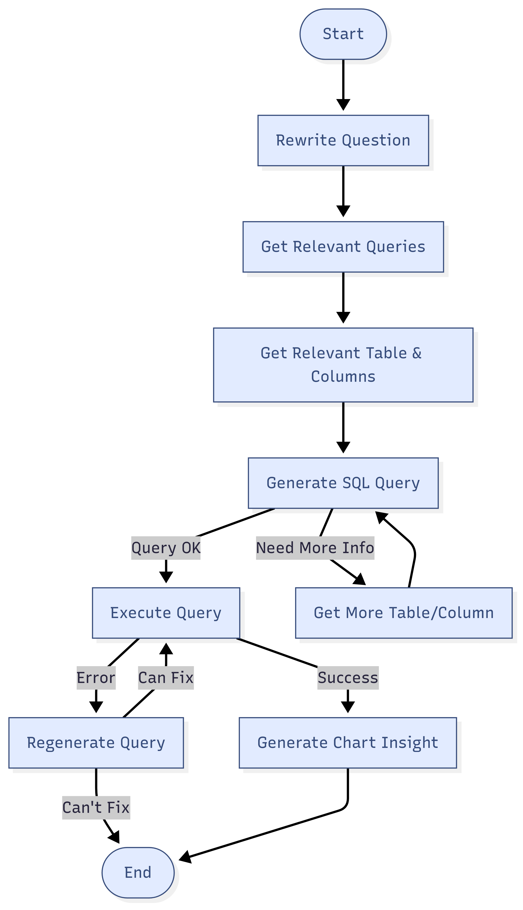

# QueryGPT: Natural Language to SQL Converter 💬🚀

This project provides a powerful workflow to translate plain English questions into precise SQL queries. By leveraging Large Language Models (LLMs) and a Pinecone vector database, QueryGPT can understand your data's structure and generate accurate queries for your specific database.

## ✨ Project Overview

The magic behind QueryGPT is a multi-step process that intelligently converts a user's question into a ready-to-use SQL query. Here's how it works:

1.  **🧠 Knowledge Ingestion:** First, it learns about your database by storing your schema information (like table and column descriptions) in a Pinecone vector index. This makes the information easily searchable.
2.  **🤖 Query Processing:** When you ask a question, a sophisticated workflow kicks in. It refines your question, fetches the most relevant details about your schema from Pinecone, and then generates the final SQL query.

---
### Query Generation Workflow :

---
## 📂 File Descriptions

### 1. `PineconeInsert.ipynb`

This notebook is your setup tool! 🛠️ It populates the Pinecone vector index with all the necessary metadata about *your* database schema.

* **Loads Your Schema:** Reads the descriptions of your database tables and columns from files you provide.
* **Formats for AI:** Structures the schema information so that it can be easily understood and retrieved by the AI.
* **Populates Pinecone:** Inserts (or "upserts") the formatted records into your Pinecone index, creating a searchable knowledge base for your database.

### 2. `Querygpt_Workflow.ipynb`

This is the main engine! ⚙️ It contains the end-to-end workflow for turning a natural language question into an SQL query. It uses `langgraph` to create a smart agent that performs several steps:

* **Question Rewriting:** The initial question is rewritten to be more specific and clear, helping the AI better understand the user's goal.
* **Context Retrieval:** The system searches the Pinecone index to find the most relevant tables, columns, and even example queries that match the rewritten question.
* **SQL Generation:** The LLM uses the original question and the retrieved context to generate a precise SQL query.
* **Execution & Refinement:** The generated query is run against your database. If an error occurs, the system is smart enough to try and fix the query and run it again.

---

## 🚀 Getting Started

Follow these steps to get QueryGPT up and running with your own database.

### 1. Prerequisites
* Python 3.x
* API keys for **Google Generative AI** and **Pinecone**.
* Your database connection details (host, port, user, password).

### 2. Configuration
* Clone the repository.
* Create a `.env` file in the root directory.
* Add your credentials to the `.env` file:
    ```
    GOOGLE_API_KEY="YOUR_GOOGLE_API_KEY"
    PINECONE_API_KEY="YOUR_PINECONE_API_KEY"
    PINECONE_HOST="YOUR_PINECONE_HOST"
    DATABASE_HOST="YOUR_DB_HOST"
    DATABASE_PORT="YOUR_DB_PORT"
    DATABASE_USER="YOUR_DB_USER"
    DATABASE_PASSWORD="YOUR_DB_PASSWORD"
    ```

### 3. Prepare Your Database Info 📝
This is the most important step for adapting the project to your needs! You need to provide details about your database schema. The `PineconeInsert.ipynb` notebook is configured to read from `.docx` files.

* Create documents containing:
    * **Table Descriptions:** Detailed explanations of each table.
    * **Column Descriptions:** Detailed explanations for each column in every table.
    * **Example Queries:** A list of sample questions and their corresponding correct SQL queries.
* Update the file paths in `PineconeInsert.ipynb` to point to your documents.

### 4. Run the Notebooks
1.  **Run `PineconeInsert.ipynb`:** Execute this notebook to populate your Pinecone index with your custom database schema.
2.  **Run `Querygpt_Workflow.ipynb`:** Use this notebook to start asking questions in natural language and receive SQL queries in return!

---

## 🛠️ Tech Stack

* **LLM:** Google Gemini
* **Vector Database:** Pinecone
* **Orchestration:** LangChain & LangGraph
* **Language:** Python
